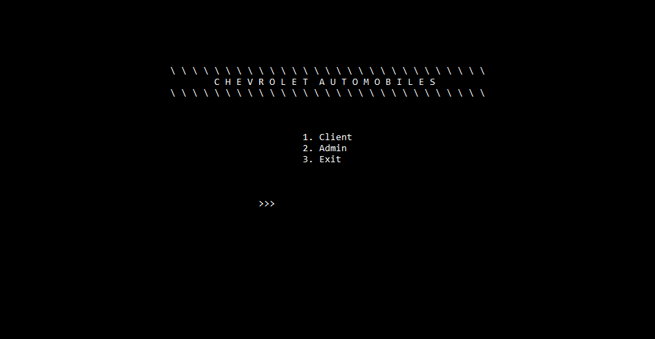
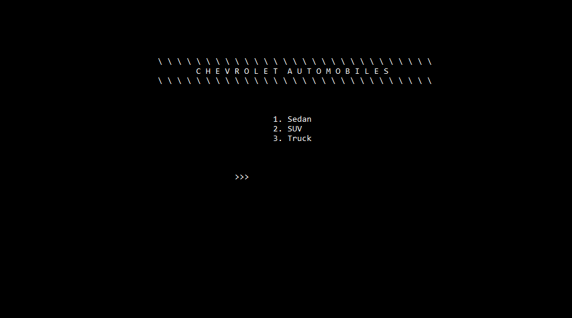
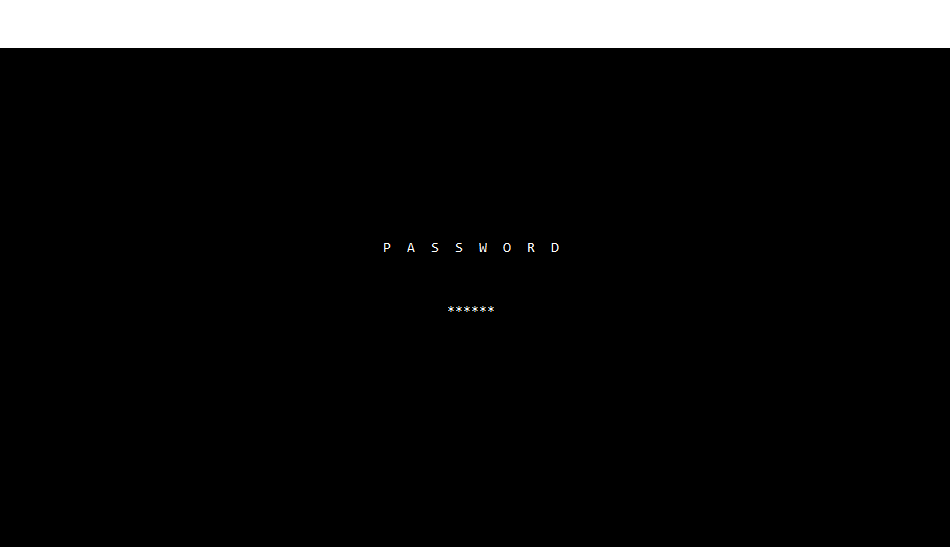
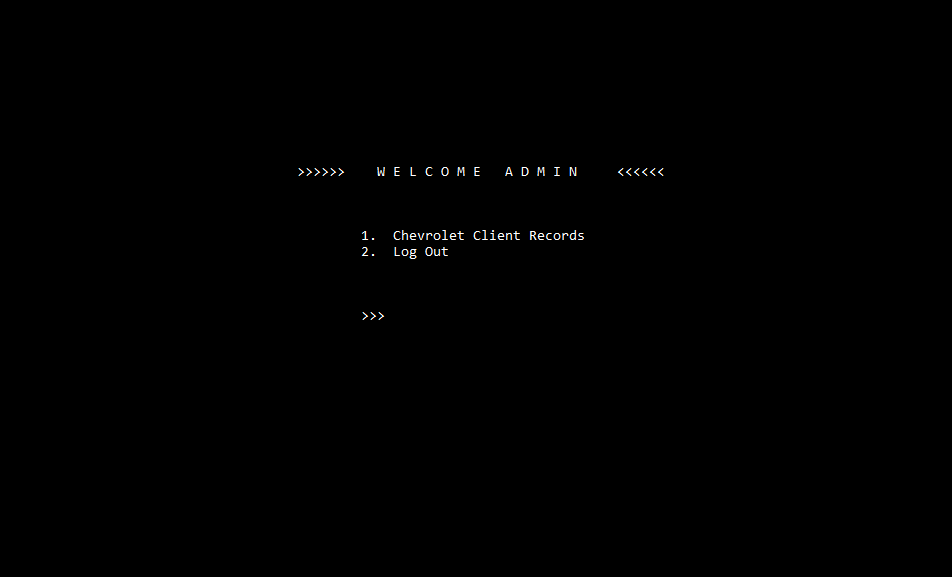
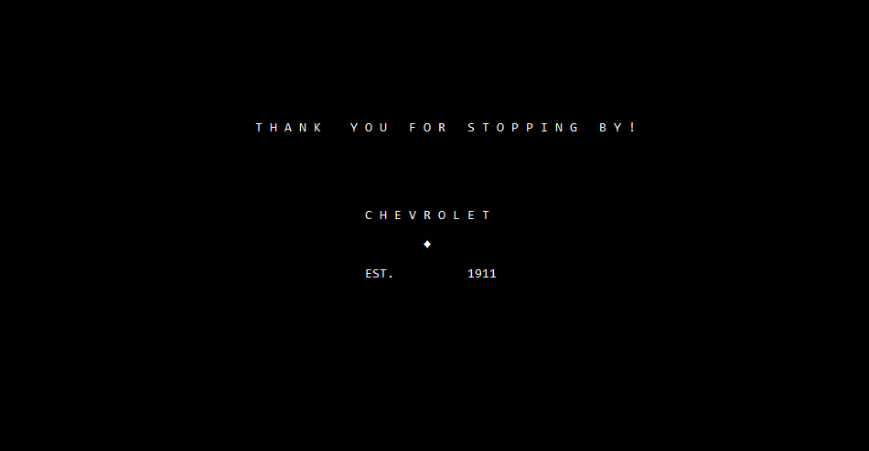

# Welcome to Chevrolet Client Record System

A *simple log system* that records the purchase details of a Chevrolet car tailored to the style and comfort of our clients. It also provides the administration a glimpse at all the records of their clientele.

Built using an interactive menu driven C++ program, our project is founded on the essential principles of OOP: classes, objects, inheritance, data abstraction and encapsulation, polymorphism

## Program Flow

- The program begins with the *main–menu panel*.

- The ***client panel*** will direct the client to customizing their car with accessories and amenities. They will be prompted to enter their personal details- name, contact number, email-and vehicle number details. The final display includes a glance at the custom-made car features along with client information and payment details.

- The **admin panel** will prompt the user for the password and upon matching, it will load to the admin menu that will allow access to the client records. Logging off will direct him to the main panel menu.
    - Admin Login Password: **chevvy**

## Built with
C++ 

### Built by Kanchan Patil and [Lizzen Camelo](https://github.com/lizzencamelo)
